class: center, middle, inverse


# Clustering Analysis I - Basic Concepts
</br>
### by [@chenwang](mailto:wangchen53@huawei.com)
---
# Table of Content

</br>
## Part 1. Introduction to Clustering Analysis

## Part 2. K-Means

## Part 3. Clustering Evaluation

## Part 4. Wrap-Up & Next.
---
class: center, middle, inverse

# Part 1: Introduction to Clustering Analysis

### 物以类聚|人以群分
---
# Clustering Analysis: Definition and Use Cases

> Cluster analysis or clustering is the task of grouping a set of objects in such a way that objects in the same group (called a cluster) are more similar (in some sense) to each other than to those in other groups.
>
><footer>Wikipedia</footer>

### Exploration: Better understanding of the world

- Biology taxonomy: Hierarchical clustering based on genetic information
(界/门/纲/目/科/属/种)

- Business: Customer segmentation for potential customers

### Data abstraction: find the most representative cluster prototypes (compression)

### Recommendation: based on similarity

### For Classification: hints for labeling

???
https://www.zhihu.com/question/21944649

---
# Clustering Methods

### Partitional

- Decomposes a data set into a set of disjoint clusters.

### Hierarchical

- Produce a nested series of partitions


&nbsp;


[1] Jain, A.K., Murty, M.N. and Flynn, P.J., 1999. Data clustering: a review. ACM computing surveys (CSUR), 31(3), pp.264-323.

---
# Clustering Problem: Definition

### Objective: finding (meaningful) groups in data
Each group is called a **Cluster**, representing some **unknown** but **existing** concept / pattern

- Input: D={$x^1, x^2, ..., x^n$}, where $x_i$ = {$x^i_1$, $x^i_2$, ..., $x^i_m$}

- Find a set of clusters (样本簇) {$C_l$ | l = 1, 2, ..., k} where:

    - $C_i$ - $C_j$ = $\emptyset$

    - $\sum_{i=1}^k$ $C_i$ = D

    - $\lambda_i$: the cluster label of $x^i$, $\lambda_i$ $\in$ {1,2,...,k}

    - Minimize the **objective function**:
        - Low density assumption: e.g., minimize Mean Square Error (MSE) $E$:

    $$ E = \sum_{i=1}^k \sum ||x - \mu_i||^2_2, x \in C_i, (\mu_i=\dfrac{1}{|C_i|} \sum x, x \in C_i)$$


???
    $$ MSE = \sum_{i=1}^k \sum ||x - \mu_i||^2_2, x \in C_i$$

---
# Clustering Types

### Hard Clustering

Assign a class label $\lambda_i$ to each patterns $x^i$, identifying its class.

### Fuzzy Clustering

Assign to each input pattern $x^i$ a fractional degree of membership $f^i_j$ in each output cluster $\lambda_j$.
---
# Illustrative Use Case: Movie Clustering

- Each movie is described by 2 features: __# of Kisses__ & __# of Kicks__

- Objectives: all movies are classified into 2 categories: __$C_1$__ or __$C_2$__ (Romance & Action)

|Movie title | # of kicks | # of kisses | Label |
| --- | --- | --- | --- |
| California Man | 3 | 104 | ? |
| He’s Not Really into Dudes | 2 | 100 | ? |
| Beautiful Woman | 1 | 81 | ? |
| Kevin Longblade | 101 | 10 | ? |
| Robo Slayer 3000 | 99 | 5 | ? |
| Amped II | 98 | 2 | ? |

---
# Movie Data Generation

```python
def generat_movieData():
    dataPoints = array([[3,140],[2,100],[1,81],[101,10],[99,5],[98,2]])
    labels = ['Romance','Romance','Romance','Action','Action','Action']
    return dataPoints, labels
```
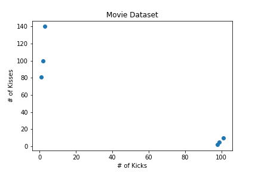
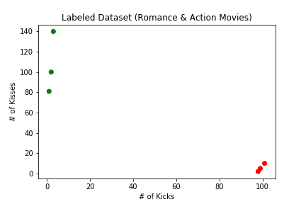
---
class: center, middle, inverse

# Part 2: K-Means
---
# Problem Description

Given a dataset D={$x^1, x^2, ..., x^n$}, we aim to find **K** unique clusters $D$ = {$C_1, C_2, ..., C_k$ }:

- Each cluster $C_i$ is described by a single point known as the **centroid** $\mu_i$

- The centroid is the **MEAN** of the values in that cluster ($\mu_i=\dfrac{1}{|C_i|} \sum x, x \in C_i$)

- The set of clusters should minimize $MSE$ as the objective function:

$$ MSE = \sum_{i=1}^k \sum ||x - \mu_i||^2_2, x \in C_i$$

### Finding the optimal solution for MSE is proved as a **NP-Hard problem** $^{[1]}$.

### **K-Means** is a heuristic algorithm that aims to find sub-optimal solution.

[1] Aloise, D., Deshpande, A., Hansen, P. and Popat, P., 2009. NP-hardness of Euclidean sum-of-squares clustering. Machine learning, 75(2), pp.245-248.
---
# How It Works?

```
Initialize cluster centroids mu_1, mu_2, ..., mu_k randomly
# converge 条件：直到所有的中心坐标都不再变化
repeat until convergence (all the centroids do not change anymore):
    C_l = [] (1 <= l <= k) # 把每个cluster 设置为空
    for each instance x_i, do:
        # 计算x_i 到每个中心坐标的距离
        Compute the distance between x_i and each centroid mu_l (1 <= l <= k), d_il
        # 选择距离最近的中心坐标，并将中心坐标代表的cluster 分配给x_i
        Choose the smallest d_il and assign l as the cluster label for x_i
        # 把x_i 加入到该中心坐标所代表的cluster 集合中
        Put x_i into the corresponding cluster C_l = C_l + x_i
    end for
    for each cluster C_l, do:
        Computer new centroid mu_l_new # 对每个cluster 计算新的中心坐标
        if mu_l_new != mu_l: # 如果中心有变化，则更新中心坐标
            mu_l = mu_l_new
        endif
    end for

Output: C=[C_1, C_2, ..., C_k]
```

---
# Iterations of Clustering Movie Dataset

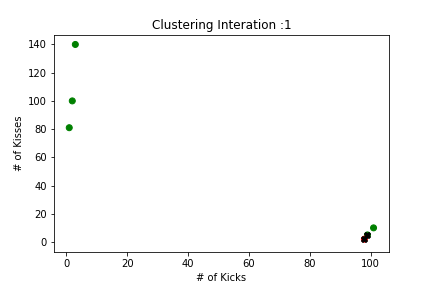
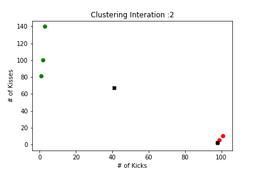
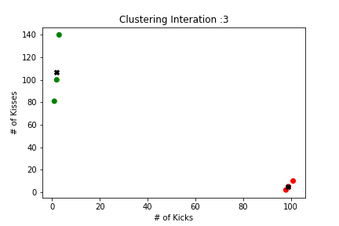
---
# Python Implementation (1/2)

### 1. Randomly  select K points as initial centroid

```python
def random_centroid (dataPoints, k): # TODO: K 个必须是不同的points

    indices = np.random.randint(len(dataPoints), size=k)

    return dataPoints[indices]
```
### 2. Calculate the Euclidean distance between to vectors

```python
def euclidean_distance(vecA, vecB):
    return np.sqrt(np.sum(np.power(vecA - vecB, 2)))
```
---
# Python Implementation (2/2)

```python
def kmeans(dataSet, k, distance_measure=euclidean_distance, centroid_init=random_centroid):
    num_points = len(dataSet)
    clusterAssment = mat(zeros((num_points,2)))
    centroids = centroid_init(dataSet, k)
    clusterChanged = True # stopping flag

    while clusterChanged:
        clusterChanged = False
        for i in range(num_points): # 遍历每个点
            minDist = inf; minIndex = -1
            for j in range(k): # 计算每个点和每个cluster 中心的距离
                distJI = distance_measure(centroids[j,:],dataSet[i,:])
                if distJI < minDist:
                    minDist = distJI; minIndex = j # 第i个点分配到第j个cluster
            if clusterAssment[i,0] != minIndex:
                clusterChanged = True
            clusterAssment[i,:] = minIndex,minDist**2 # 第i 个节点分配的cluster
        for cent in range(k): # 更新centroid
            ptsInClust = dataSet[nonzero(clusterAssment[:,0].A==cent)[0]]
            centroids[cent,:] = mean(ptsInClust, axis=0)

    return centroids, clusterAssment
```

---
# Implementation Using Scikit-Learn

```python
from sklearn.cluster import KMeans

kmeans_movie = KMeans(n_clusters=2, random_state=0).fit(movie_data)
```

```python
$> kmeans_movie.labels_
array([1, 1, 1, 0, 0, 0], dtype=int32)

```
---
class: center, middle, inverse

# Part 3: Cluster Evaluation

---
# Cluster Validity: Evaluate the Goodness of Clusters

### How meaningful the outcome is?

- Depends on the objective and application domain.

- There is no gold standards

### Objective:

- Inter-Cluster Distance (簇间距): As much as possible

- Intra-Cluster Distance (簇内距): As small as possible

### Validity Index

- **External Index**: compare with a reference model

- **Internal Index**: only rely on the properties intrinsic to the data set

???

Why We Need Clustering Validation?

- Clustering Algorithm can anyhow find out clusters, even if the dataset has no natural cluster structure;

- Determine the **Cluster Tendency**
    - If there is any merit to a cluster analysis prior to one being performed
- Determine the right number of clusters
- Determine how well the clustering results are
---
# External Index

### Validation with the Ground Truth
Clustering Results:
- C = {$C_i$ | i = 1, 2, ..., k}
- $\lambda_i$: the cluster outcome of $x_i$, $\lambda_i$ $\in$ {1,2,...,k}

Ground Truth:
- $\tilde{C}$ = {$\tilde{C}_j$ | j = 1, 2, ..., s}
- $\tilde{\lambda}_i$: the cluster label of $x_i$, $\tilde{\lambda}_i$ $\in$ {1,2,...,s}

We compare every pair of instances $x_i$ and $x_j$, we have:
- a = |SS|, |SS| = {($x_i, x_j$) | $\lambda_i$ = $\lambda_j$, $\tilde{\lambda}_i$ = $\tilde{\lambda}_j$, i<j}
- b = |SD|, |SD| = {($x_i, x_j$) | $\lambda_i$ = $\lambda_j$, $\tilde{\lambda}_i$ $\neq$ $\tilde{\lambda}_j$, i<j}
- c = |DS|, |DS| = {($x_i, x_j$) | $\lambda_i$ $\neq$ $\lambda_j$, $\tilde{\lambda}_i$ = $\tilde{\lambda}_j$, i<j}
- d = |DD|, |DD| = {($x_i, x_j$) | $\lambda_i$ $\neq$ $\lambda_j$, $\tilde{\lambda}_i$ $\neq$ $\tilde{\lambda}_j$, i<j}
---
# Validity Index

### Jaccard Coefficient (JC)

$$ RI = \dfrac{a}{a+b+c} $$

### Fowlkes and Mallows Index (FMI)

$$ FMI = \sqrt{\dfrac{a}{a+b} * \dfrac{a}{a+c}} $$

### Rand Index (RI)

$$ RI = \dfrac{2(a+d)}{m(m-1)}$$

\* The index value is in [0, 1], larger is better.
---
# Internal Index

### Rely on the clustering results

Clustering Result: C = {$C_i$ | i = 1, 2, ..., k}, for each cluster $C$, we define:

- avg($C$) = $\dfrac{2}{|C|(|C|-1)}$ $\sum_{1 \leq i<j \leq |C|}$ dist($x_i$, $x_j$)
    - dist(x, y): Distance Measurement

- diam(C) = $max_{1 \leq i<j \leq |C|}$ dist($x_i$, $x_j$)

- $d_{min}$ ($C_i$, $C_j$) =  min dist($x_i$, $x_j$), for $x_i$ in $C_i$, $x_j$ in $C_j$

- $d_{c}$ ($C_i$, $C_j$) =  dist($\mu_i$, $\mu_j$)
    - $\mu_i$: centroid of cluster $C_i$
---
# Validity Index

### Davies-Bouldin Index (DBI) - Smaller is better

$$ DBI = \dfrac{1}{K} \sum_{i=1}^K MAX \dfrac{avg(C_i) + avg(C_j)}{d_c(C_i, C_j)}, (j \neq i)$$

### Other methods:

- Dunn Index (DI) - Larger is better

- Average Sihouette Width

- Mutual Information

- F-Value

---
# Distance Function

We have two instances:
- $x^i$ = {$x^i_1$, $x^i_2$, ..., $x^i_m$}

- $x^j$ = {$x^j_1$, $x^j_2$, ..., $x^j_m$}

We want to define a distance function $dist(x^i, x^j)$ to compute the distance between $x^i$ and $x^j$.

### Properties of Distance Measurements (Function)

- 非负性: $ dist(x^i, x^j) \geq 0 $

- 同一性: $ dist(x^i, x^j) = 0, iff: x^i = x^j $

- 对称性: $ dist(x^i, x^j) = dist(x^j, x^i) $

- 直递性: $ dist(x^i, x^j) \leq dist(x^i, x^k) + dist(x^k, x^j)$
---
# Distance Function

### Minkowski Distance ($L_p$ Regularization)

$$ dist(x^i, x^j) = (\sum_{u=1}^m |X^i_u - x^j_u|^p)^{1/p} $$

- Manhattan Distance (p=1)

第五大道与33街的十字路口 第三大道与第23街的十字路口，需要走(5-3)+(33-23)=12个街区

- Euclidean Distance (P=2)


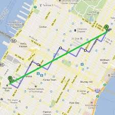


---
# Problem: Distance Measurements for Non-Ordinal Features

### Data Type:

- Continuous Attributes (连续属性): temperature, stock price, etc.

- Categorical Attributes (离散属性): gender, weekdays, etc.

### Ordinality

- Ordinal Attributes: the value of attributes than can be compared

    - Weekdays: ```D('Fri.', 'Mon.') = 4```

- Non-Ordinal Attributes: the value of attributes than **cannot** be compared

    - e.g., Car_Manufactor ={'Ford', 'BYD', 'Toyota', 'Audi', 'Mercedes-Benz', 'BMW'}

- Not all numbers are continuous attributes

    - Phone number, zip code

---
# Distance Measurements for Non-Ordinal Features

### Value Difference Metric (VDM)

For a non-ordinal feature $x_j$, we define:

- a, b: two possible values of $x_j$

- $m_a$: the number of instances whose feature $x_j$ equals to a;

- $m_a^i$: in the cluster $C_i$, the number of instance whose feature $x_j$ equals to a;

$$VDM (a, b) = \sum^k_{i=1} |\dfrac{m_a^i}{m_a} - \dfrac{m_b^i}{m_b}|^p$$

\* Differences between two normalized histogram

???
# Distance Measurement

### We have m features
- the first h features are ordinal
- The rest are non-ordinal

$$ d(x^i, x^j) = (\sum_{u=1}^h |X^i_u - x^j_u|^p + \sum_{u=h+1}^m VDM (x_i^u, x_j^u)  )^{1/p} $$

### Weighted Distance:

$$D(x^i, x^j) = (w_1 |x^i_1 - x^j_1|^p + w_2 |x^i_2 - x^j_2|^p + ... + w_m |x^i_m - x^j_m|^p)^{1/p}$$

---
class: center, middle, inverse

# Part 4: K-Means Improvement

---
# Problem 1: Local Mimimum

### Randomly generate some data points in X-Y plane
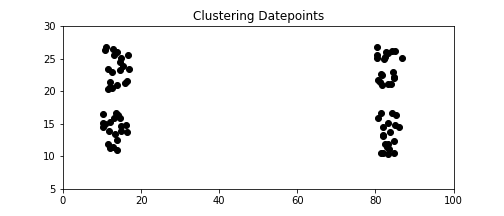

### Running K-Means Clustering (K=4)
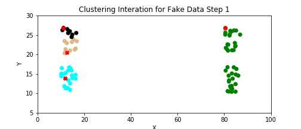


---
# Solution 1:

### Do many times with different initialization of centroids.

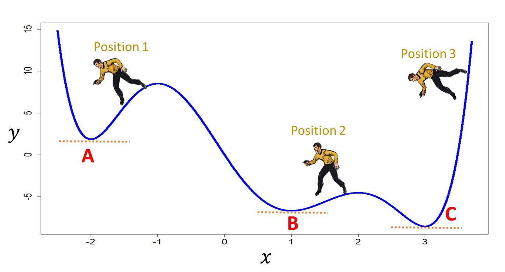

---

# Solution 2: K-Means++


### Choose points that are as far as possible.
k-means++ initialization scheme: This initializes the centroids to be (generally) distant from each other, leading to provably better results than random initialization

```python
kmeans_movie = KMeans(n_clusters=2, init='k-means++').fit(movie_data)
```

### Discussion: how to measure the degree of separation?

“k-means++: The advantages of careful seeding” Arthur, David, and Sergei Vassilvitskii, Proceedings of the eighteenth annual ACM-SIAM symposium on Discrete algorithms, Society for Industrial and Applied Mathematics (2007)

---
# Solution 3: Bisecting K-Means

### Idea: iteratively split a **selected** cluster into 2 sub-clusters

### Pseudo Code:
```
All points are regarded as one cluster

Loop: until the the number of Clusters has been reached
     Loop: for each cluster C_l

          Compute the total error E of C_l

          Apply the K-Means Algorithm to C_l with k= 2

          Measure the total error E of the 2 new clusters compared to C_l
      End Loop

      Chose the cluster split that gives the lowest error increase and commit this split
End Loop
```


 "A comparison of document clustering techniques", M. Steinbach, G. Karypis and V. Kumar. Workshop on Text Mining, KDD, 2000
---
# Clustering Using Bisecting K-Means (K=4)

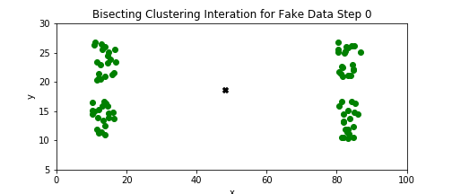
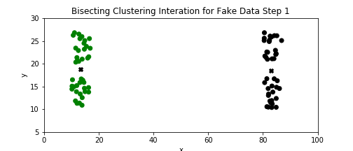
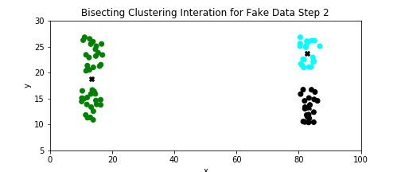
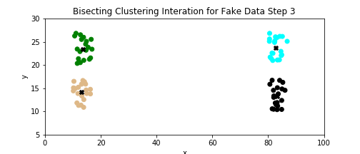
---
# Homework 1

### Implement Bisecting K-Means

- Pick a **cluster evaluation function** (ref. Part 3)

- Implement pseudo code of bisecting K-Means clustering process

---
# Problem 2: Empty Cluster

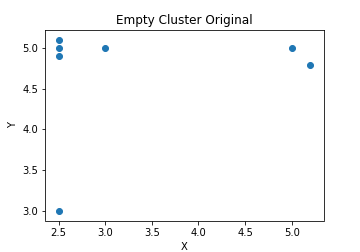
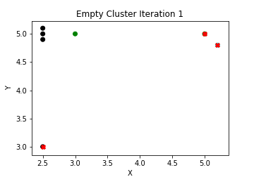
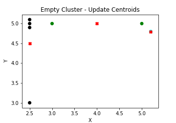
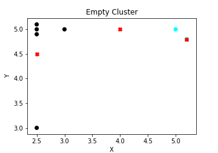
---
# Homework 2

### Improve K-Means by replacing the centroid of an empty cluster.

- Solution 1: Select the point that is the farthest from any current centroid;

- Solution 2: Select new centroid for the cluster with the highest SSE;
---
# Problem 3: Efficiency

### Complexity: O (n \* K \* I \* m), where:
- n: the number of samples
- m: the number of features
- K: the number of clusters
- I: the number of iterations

E.g., If we have 5,000,000 log entries, and we want to divide them into 1,000 clusters.
Using One-Hot encoding, each log entry has 1,000 features. Suppose I = 20, we have the computation complexity: **$10^{14}$**

### Objective: Reduce Computation Time
- Mini-Batch: subsets of the input data, randomly sampled in each iteration
    - l samples are drawn randomly from the dataset, to form a mini-batch
    - Update centroids as per-sample basis
        - This has the effect of decreasing the rate of change for a centroid over time

“Web Scale K-Means clustering” D. Sculley, Proceedings of the 19th international conference on World wide web (2010)

---
# Mini-Batch K-Means: Pseudo Code

```
Given: k, mini-batch size b, iterations t, data set X
Initialize each c ∈ C with an x picked randomly from X
v ← 0
for i = 1 to t do
      M ← b examples picked randomly from X
      for x ∈ M do
            d[x] ← f (C, x)           // Cache the center nearest to x
      end for
      for x ∈ M do
            c ← d[x]                    // Get cached center for this x
            v[c] ← v[c] + 1         // Update per-center counts
            η ← 1 / v[c]              // Get per-center learning rate
            c ← (1 − η)c + ηx      // Take gradient step
      end for
end for
```

---
# Evaluation of Mini-Batch K-Means

### Performance: slightly **worse** than normal K-Means

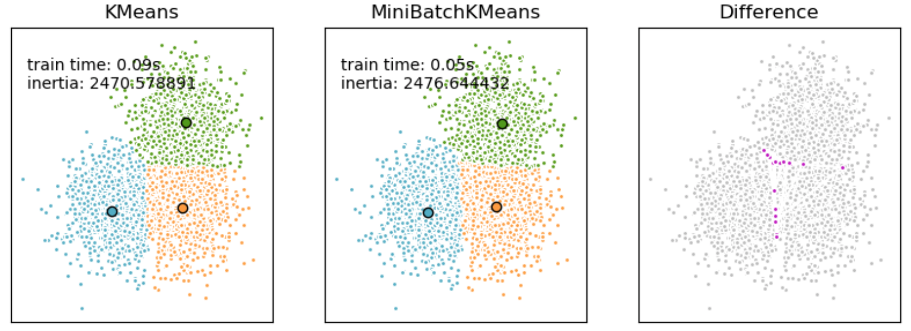


---

# Problem 4: How to Choose the Best K?

### Q: Which clustering result is more meaningful for you?

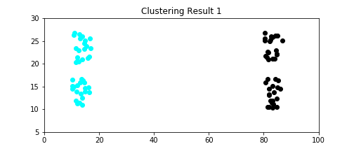
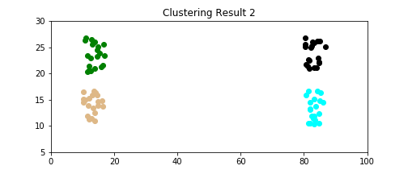

### "Elbow" method
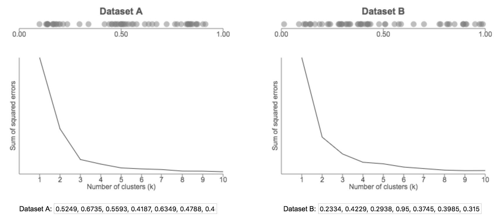

---
# Improve Robustness - Handle Outliers

---
class: center, middle, inverse

# Part 5: Wrap-up
---
# Limitation of K-Means - Compact, Isolated Clusters

### Sample Clusters


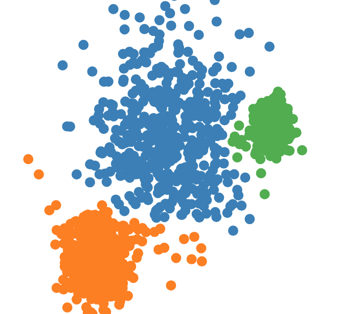

--
### Clustering Using K-Means


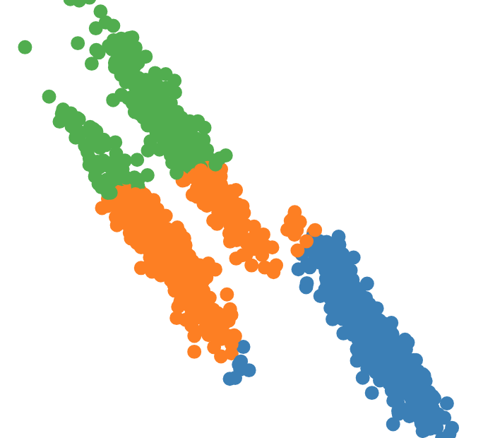
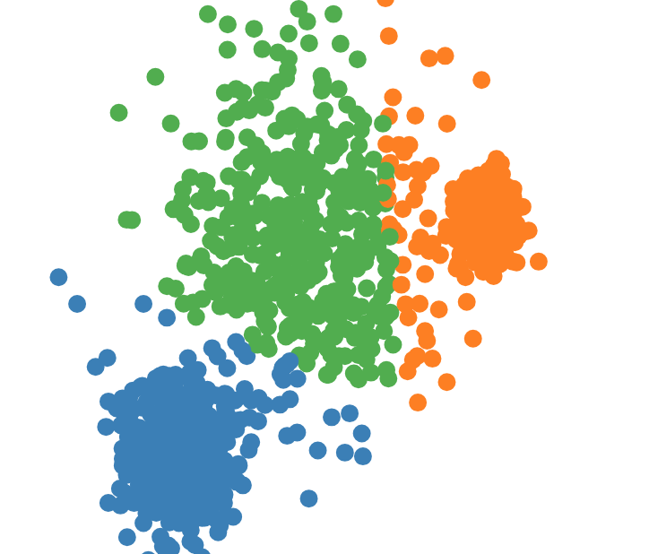

---
# Next.

### Date: Apr. 10, 2017
### Time: 18:30 ~ 20:30
### Topic: Clustering Analysis II - Advanced Topics

???

# backups

clustering: exploratory data analysis

normalization

Prototype-based clustering (Instance-based clustering)

hierarchical clustering: AGNES (AGglomerative NESting)

exploratory and confirmatory

If both low-density and continuity patterns exist, how to choose the best algorithm?

data normalization?

# Density Based Clustering

### Continuity Assumption

### Density-based spatial clustering of applications with noise (DBSCAN)

# DBSCAN

Dimension Reduction
